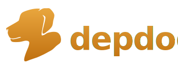
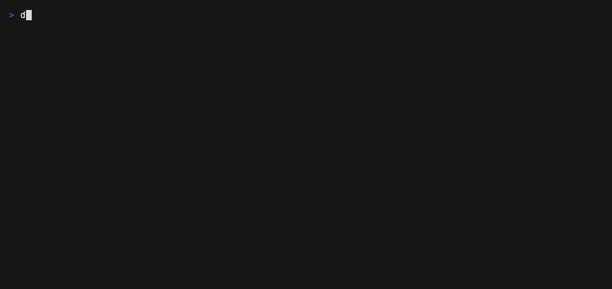

<div align="center">



**A Codebase Dependency Watchdog** — your architecture rules, enforced on every build.

[](https://pkg.go.dev/github.com/matterpale/depdog)
[](https://github.com/matterpale/depdog/actions/workflows/ci.yml)
[](https://github.com/matterpale/depdog/releases)
[](LICENSE)

[**Install**](#install)&nbsp;·&nbsp;[**Quick start**](#quick-start)&nbsp;·&nbsp;[**Configuration**](#configuration)
&nbsp;·&nbsp;[**Commands**](#commands)&nbsp;·&nbsp;[**CI**](#ci)

</div>

<p align="center">
  
</p>

**depdog** is a *dependency watchdog*: architecture rules — *"the domain imports
nothing but the standard library," "handlers never import repositories"* —
usually live in someone's head or a wiki, and they rot. depdog makes them
executable: you declare which **components** exist and who may import whom in one
small `depdog.yaml`, and `depdog check` enforces it against every import edge in
your codebase, exiting non-zero for CI. One neutral rule format, one engine —
depdog just swaps a thin language adapter per project ([see below](#multi-language-support)).

```
depdog check — github.com/matterpale/depdog

✗ core: allow [std]  (2 violations)
    github.com/matterpale/depdog/internal/core
      → github.com/matterpale/depdog/internal/report   internal/core/evaluate.go:9
      → github.com/charmbracelet/lipgloss              internal/core/core.go:12

2 violations · 10 packages · 107 edges checked in 112ms
```

## Install

**Homebrew** (macOS):

```bash
brew install --cask matterpale/tap/depdog
```

**Go:**

```bash
go install github.com/matterpale/depdog/cmd/depdog@latest
```

Prebuilt binaries for Linux, macOS, and Windows are on the
[releases page](https://github.com/matterpale/depdog/releases); building from
source (`go build -o depdog ./cmd/depdog`) needs Go 1.26+.

## Quick start

```bash
depdog init      # scan the module and write a starter depdog.yaml
depdog check     # enforce the rules; exit 1 on violations
```

`init` inspects your layout, matches it against an architecture preset, and
proposes a component mapping you refine interactively — drop, rename, or
re-pattern components — or accept as-is with `--yes`. It refuses to touch an
existing `depdog.yaml`; as the code grows, `depdog init --merge` rescans the
module and appends a component (and, under `default: deny`, a starter rule)
for every directory no existing pattern covers — editing the file in place
without disturbing your comments, ordering or formatting. When everything is
covered it changes nothing and says so.

## Configuration

`depdog.yaml` lives at the repo root, next to `go.mod`:

```yaml
version: 2

# Each component lists its path glob(s) and, inline, who it may import.
components:
  main: { path: "cmd/**" }                                # no rule → open (the default)
  domain: { path: "internal/domain/**", allow: [ std ] }      # whitelist: std only
  handler: { path: "internal/handler/**", deny: [ service, repository ] } # forbids its peers
  service: { path: "internal/service/**", deny: [ handler, repository ] }
  repository: { path: "internal/repository/**", deny: [ handler, service ] }

default: allow   # fallback for a rule-less component (like main); the default if omitted

options:
  test_files: hybrid              # default; also: same-rules, relaxed
  skip: [ "internal/legacy/**" ]    # package dirs excluded from analysis
```

Here `domain` is a **whitelist** (an `allow` list — only what's listed passes) and the
three peers are **blacklists** (a `deny` list — everything except what's listed); the
stance is read per component from which word you use. `main` has no rule at all, so it
falls back to the top-level `default` — which is `allow`, so it may import anything
(an explicit `allow: ["*"]` would be equivalent, just noisier). `path` takes a single
glob or a list (`path: ["internal/api/**", "internal/rpc/**"]`).

An editor JSON Schema ships at
[`schema/depdog.schema.json`](schema/depdog.schema.json) for autocomplete and
validation (a test keeps it in lockstep with the parser).

### Components and matching

A component is a named set of packages: each `path` glob is matched, recursive
doublestar style, against module-relative package directories. When patterns
overlap, the most specific one wins; equal specificity is an ambiguity error,
not a silent pick.

### What goes in `allow` and `deny`

| Entry                  | Matches                                                             |
|------------------------|---------------------------------------------------------------------|
| `domain`, `handler`, … | another component, by name                                          |
| `std`                  | the Go standard library                                             |
| `external`             | any module that isn't yours                                         |
| `unassigned`           | in-module packages no component claims                              |
| `"*"`                  | everything                                                          |
| `golang.org/x/sync`    | one specific external module, by prefix — any entry with `/` or `.` |

**Groups** name a reusable set of components: declare `groups: { inner:
[domain, core] }`, then reference `inner` in any allow/deny list; it expands
to its members when the config loads.

Two rules of precedence to remember: an explicit `deny` always beats an
`allow`, and a component with neither falls back to the top-level `default` —
set `default: deny` to make unruled components fail closed (`init` asks which
stance you want).

### Boundaries

Components answer "who may this layer import?" along one axis. **Boundaries** add
a second, orthogonal axis: named sets of *members* that may not import across
each other. A package keeps its most-specific component **and**, independently,
belongs to every boundary whose region contains it — so
`cmd/service-a/services/x` can be the `service-a-services` component (subject to
layer rules) and a member of the `cmd-services` boundary (subject to isolation)
at once. That dissolves two kinds of boilerplate: peer `deny` lists ("layers
don't import each other") and cross-cutting isolation ("no service imports
another"), which otherwise needs O(n²) deny lists.

```yaml
boundaries:
  # shorthand — a symmetric peer set; these three may not import each other
  service-a-layers: [ service-a-repositories, service-a-services, service-a-handlers ]

  # expanded form — members can be path globs, and sealed adds a one-way wall
  cmd-services:
    members: [ "cmd/service-a/**", "cmd/service-b/**" ]
    sealed: true
```

A **member** is a component name *or* a path glob (told apart by the same `/`-or-
metacharacter heuristic as allow/deny refs); the two may mix in one boundary.

| edge                                   | verdict                                                    |
|----------------------------------------|------------------------------------------------------------|
| member A → member B (A ≠ B)            | **denied** (a hard deny — wins over any component `allow`) |
| within one member (incl. same package) | allowed                                                    |
| member → ungrouped (e.g. a shared lib) | allowed                                                    |
| ungrouped → member                     | allowed — **denied** when the boundary is `sealed`         |

`sealed: true` adds one rule: nothing outside all members may import *into* a
member. The wall is one-way, so a service may still import a shared lib, but a
shared lib (or another service) must not reach in. Boundaries are **composable**
(each edge is checked against every boundary plus the component rules) and
**orthogonal to assignment** — membership never silences the `unassigned`
warning for a package no component claims. `explain` reports a crossing as
`denied by boundary "cmd-services"`, with `(sealed)` for the one-way rule.

### Signals that never fail the build

Three findings are always reported but never exit non-zero on their own —
visibility without blocking adoption:

- **Unmapped packages.** In-module packages no component claims are warnings;
  unmapped packages are how rule sets rot, so they stay visible.
- **Dead patterns.** A component whose patterns match no package is flagged —
  a likely typo.
- **Component cycles.** `a ↔ b` at the architecture level (which a
  package-level compile check can't even have) is detected and reported as an
  advisory.

### Test files

`test_files: hybrid` (the default) lets `_test.go` files import any external
module while still enforcing component-to-component rules; `same-rules` is
strict, `relaxed` exempts test files entirely.

## Commands

| Command                                          | What it does                                                                                                                                                                                                 |
|--------------------------------------------------|--------------------------------------------------------------------------------------------------------------------------------------------------------------------------------------------------------------|
| `depdog init`                                    | Scan the module and write a starter `depdog.yaml`; `--merge` extends an existing one in place                                                                                                                |
| `depdog check [packages]`                        | Evaluate every import edge against the rules                                                                                                                                                                 |
| `depdog baseline`                                | Record current violations to `depdog.baseline.yaml` for the [ratchet](#adopting-rules-on-a-codebase-that-doesnt-pass-yet)                                                                                    |
| `depdog graph`                                   | Emit the dependency graph as DOT or Mermaid                                                                                                                                                                  |
| `depdog explain <component-or-package> [import]` | Explain why something is red (the rule or boundary that fired, with file:line), how a component is constrained, its boundary membership, or whether *A* may import *B* and which rule or boundary decides it |
| `depdog config`                                  | Print the compiled rule set — components, patterns, inferred stances, boundaries, options — for debugging a config                                                                                           |
| `depdog tui` (or bare `depdog`)                  | Interactive terminal UI: component dashboard, browsable violations, per-package imports and importers, and a Config tab showing the compiled rules                                                           |

<details>
<summary><b>All flags</b></summary>

| Command | Flags                                                                                                                                                                                            |
|---------|--------------------------------------------------------------------------------------------------------------------------------------------------------------------------------------------------|
| `init`  | `--preset ddd\|hexagonal\|layered\|flat` · `--default deny\|allow` · `--yes` (non-interactive) · `--force` (overwrite) · `--merge` (extend an existing file, preserving comments and formatting) |
| `check` | `--format text\|json\|github\|sarif` · `--fail-on any\|new` · `--color auto\|always\|never`                                                                                                      |
| `graph` | `--format dot\|mermaid` · `--level component\|package` · `--violations-only` · `--focus <component>`                                                                                             |

</details>

In the TUI, <kbd>1</kbd>–<kbd>4</kbd> (or <kbd>tab</kbd>) switch between the
Dashboard, Violations, Packages and Config screens. The Violations and Packages
lists scroll and filter with <kbd>/</kbd>; <kbd>e</kbd> opens the selection in
`$EDITOR` at its file:line, <kbd>r</kbd> re-runs the check in place, and
<kbd>?</kbd> shows all keys. The Config tab (<kbd>4</kbd>) shows the active
config path and the compiled rule set (the same data as `depdog config`);
<kbd>e</kbd> there opens `depdog.yaml` in `$EDITOR`, and the editor exiting
auto-re-runs the check so the edited rules take effect on every screen.

Exit codes are a contract:

| Code | Meaning                      |
|:----:|------------------------------|
| `0`  | clean                        |
| `1`  | violations                   |
| `2`  | configuration or usage error |

## CI

`depdog check` is CI-ready as-is. For inline pull-request annotations use the
GitHub format; for GitHub code scanning, emit SARIF:

```yaml
- run: go run github.com/matterpale/depdog/cmd/depdog check --format github

# or, for the code-scanning tab:
- run: go run github.com/matterpale/depdog/cmd/depdog check --format sarif > depdog.sarif
- uses: github/codeql-action/upload-sarif@v3
  with: { sarif_file: depdog.sarif }
```

### Adopting rules on a codebase that doesn't pass yet

Record today's violations as a baseline, then fail only on new ones — and shrink
the baseline over time:

```bash
depdog baseline                 # writes depdog.baseline.yaml
depdog check --fail-on new      # exits 1 only on violations not in the baseline
```

## depdog checks itself

depdog's own architecture is declared in its [`depdog.yaml`](depdog.yaml) and
enforced in CI: the language-agnostic engine (`internal/core`) depends on the
standard library only, language knowledge lives behind an adapter interface,
and the layers above may only import inward. A failing architecture is a
failing build.

## Multi-language support

depdog checks **seven** languages with the *same* `depdog.yaml`, the *same*
commands (`check`, `graph`, `explain`, `config`, TUI), and the *same* engine.
Only a thin language adapter differs; the rule format is neutral — component
`path` globs match project-relative directories, and `std` / `external` are
abstract buckets each adapter fills (Go stdlib vs Node builtins vs the Python
stdlib; a Go module vs an `node_modules` package vs a gem). Every adapter is a
pure-Go static import scanner — **no language toolchain is required** (no
Node/`tsc`, no `python`, no `cargo`), depdog stays a single binary.

|        | Language | Detected by                               | Scans                                               |
|--------|----------|-------------------------------------------|-----------------------------------------------------|
| `go`   | Go       | `go.mod`                                  | package imports                                     |
| `rs`   | Rust     | `Cargo.toml`                              | `use` / `mod` / `extern crate`                      |
| `py`   | Python   | `pyproject.toml`, `setup.py`, `setup.cfg` | `import` / `from … import` (incl. relative)         |
| `kt`   | Kotlin   | `build.gradle.kts`, `settings.gradle.kts` | `package` + `import`                                |
| `java` | Java     | `pom.xml`, `build.gradle`                 | `package` + `import`                                |
| `rb`   | Ruby     | `Gemfile`, `.ruby-version`, `Rakefile`    | `require` / `require_relative` / `autoload`         |
| `ts`   | TS / JS  | `tsconfig.json`, `package.json`           | `import`/`export from`/`require`/dynamic `import()` |

`internal/core` (the engine) never changed as languages were added — the whole
point of the [adapter registry](internal/cli/languages.go) is that a new
language is one `internal/lang/<x>` package plus one registry entry.

**Auto-detection.** depdog picks the adapter from the project's marker files,
walking up from the working directory; the marker nearest the working directory
wins in a nested layout (e.g. a `web/` TS app inside a Go repo).

**Explicit override.** The persistent `--lang` flag (available to every
subcommand) bypasses detection:

```bash
depdog check --lang py        # force the Python adapter
depdog graph --lang rs        # force the Rust adapter
```

A directory that carries markers for **two** languages with no `--lang` is
genuinely ambiguous: depdog exits with a usage error naming `--lang` rather than
silently guessing.

## For AI agents

depdog is built to be driven by tools and agents, not just humans:

- **Machine-readable output.** `depdog check --format json` emits a stable
  schema (violations, components, boundaries, stats); the [exit codes](#commands)
  are a contract (`0` clean, `1` violations, `2` config/usage error). `depdog
  config --format json` dumps the compiled rules so an agent can inspect what a
  config actually means before changing it.
- **Polyglot-aware.** Auto-detect or `--lang` means an agent doesn't need to
  know the language up front; a monorepo can be checked per subtree.
- **A playbook for authoring `depdog.yaml`.**
  [`skills/depdog-config/SKILL.md`](skills/depdog-config/SKILL.md) is a
  self-contained, tool-agnostic guide any coding agent can follow: it maps a
  codebase's layout to components and import rules, writes a `depdog.yaml`, and
  iterates with `depdog check`/`explain`/`config` until it matches the intended
  architecture (the full config-format reference is inline). Point your agent at
  that file directly, or drop the folder into wherever your agent discovers
  reusable skills or instructions — it's a standard skill directory (`SKILL.md`
  with front-matter), so it works as a skill for editor agents, as an
  `AGENTS.md` reference, or as plain context you paste in.
- **Editor schema.** [`schema/depdog.schema.json`](schema/depdog.schema.json)
  gives autocomplete and validation in any JSON-schema-aware editor or agent.

## Limitations

- **Static analysis.** Every adapter scans source for import statements; it does
  not run or type-check your code. Fully dynamic imports (a computed
  `require(someVar)`, a reflective Java classload) are invisible by design —
  architecture rules are about the imports you *write*.
- **Go adapter — one build configuration.** The Go adapter loads packages for
  the host's `GOOS`/`GOARCH` and default build tags; imports guarded by other
  build constraints (e.g. `//go:build windows` on a non-Windows machine) aren't
  seen.
- **Go adapter — single module.** Go workspaces (`go.work`) aren't supported:
  depdog checks one module and declines to run inside a workspace with a clear
  message (set `GOWORK=off` to bypass a workspace and check the module directly).

## Status

v0.5.0 — the current release. depdog now checks **seven** languages (Go,
TypeScript/JS, Python, Rust, Java, Ruby, Kotlin) through a pluggable adapter
registry, on top of the config v2 format (per-component `allow`/`deny`,
`default` stance) and `boundaries` (orthogonal mutual-exclusion groups). The
M0–M5 roadmap is complete; editor/LSP integration is the main item still ahead.

## License

[MIT](LICENSE)

---

<p align="center"><sub>🐕 <em>woof.</em></sub></p>
